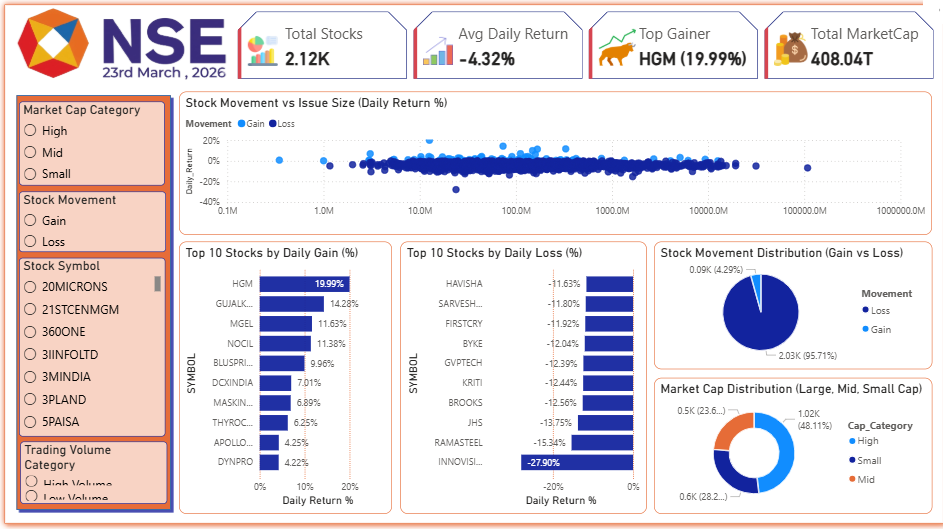
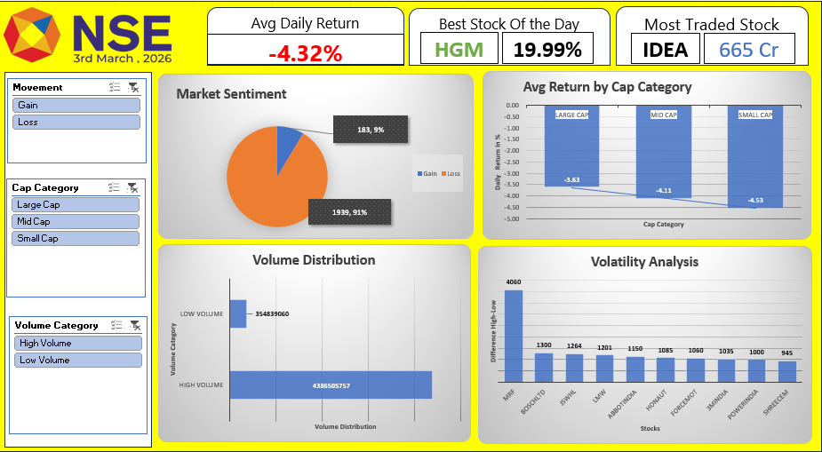

# 📊 NSE Stock Market Analysis Project

## 🚀 Project Overview

This project is an **end-to-end stock market data analysis pipeline** built using:

* SQL (MySQL)
* Python (Pandas)
* Power BI
* Microsoft Excel

The goal of this project is to analyze **NSE stock data (23rd March 2026)** and extract meaningful insights related to **market performance, stock behavior, and trading activity**.

---

## 🎯 Objectives

* Clean and preprocess raw stock market data
* Perform data analysis using SQL and Python
* Build interactive dashboards in Power BI
* Create analytical reports in Excel
* Identify top-performing and high-opportunity stocks

---

## 🛠️ Tools & Technologies Used

| Tool            | Purpose                        |
| --------------- | ------------------------------ |
| MySQL           | Data storage & SQL queries     |
| Python (Pandas) | Data cleaning & transformation |
| Power BI        | Interactive dashboard          |
| Excel           | Analytical charts & summaries  |

---

## 🔄 Project Workflow

```text
Raw Data → SQL → Python Cleaning → SQL (Clean Data) → Power BI → Excel
```

## 📸 Dashboard Preview

### 🔹 Power BI Dashboard

Interactive dashboard showing stock performance, gainers & losers, market cap distribution, and issue size vs return analysis.



---

### 🔹 Excel Dashboard

Analytical dashboard focused on market sentiment, cap category performance, volume distribution, and volatility insights.




---

## 🧹 Data Cleaning Steps

### In SQL:

* Removed unnecessary columns
* Handled missing values
* Standardized column names

### In Python:

* Converted data types
* Created new columns:

  * `daily_return`
  * `price_range`
  * `movement`
  * `cap_category`
* Merged datasets

---

## 📈 Power BI Dashboard Features

* KPI Cards:

  * Total Stocks
  * Market Cap
  * Avg Return
  * Volume
* Top Gainers & Losers
* Market Sentiment (Gain vs Loss)
* Cap Category Distribution
* Scatter Plot (Issue Size vs Return)
* Interactive Slicers

---

## 📊 Excel Dashboard Features

* Market Sentiment (Pie Chart)
* Cap Category Analysis
* Avg Return Comparison
* Volume Distribution
* Volatility Analysis
* Relative Performance (%) chart
* Opportunity Score-based analysis

---

## 🧠 Key Concepts Used

* Data Cleaning & Transformation
* Feature Engineering
* Data Visualization
* Pivot Tables & Charts
* KPI Design
* Analytical Modeling (Opportunity Score)

---

## 💡 Key Insights

* Majority of stocks showed **loss on the selected day**
* Small-cap stocks showed **higher volatility**
* High-volume stocks indicated **strong market activity**
* Opportunity Score helped identify **potential short-term stocks**

---

## ⚠️ Disclaimer

This project is for **educational and analytical purposes only**.
It does not provide financial or investment advice.

---

## 📁 Project Structure

```text
├── SQL/
├── Python/
├── PowerBI/
├── Excel/
├── Dataset/
└── README.md
```

---

## 🙋‍♂️ Author

**Vansh Shah**

* LinkedIn: https://www.linkedin.com/in/vansh-shah-632757244/
* GitHub: https://github.com/Vanshshah2325

---

## ⭐ If you like this project

Give it a ⭐ on GitHub and feel free to connect!
